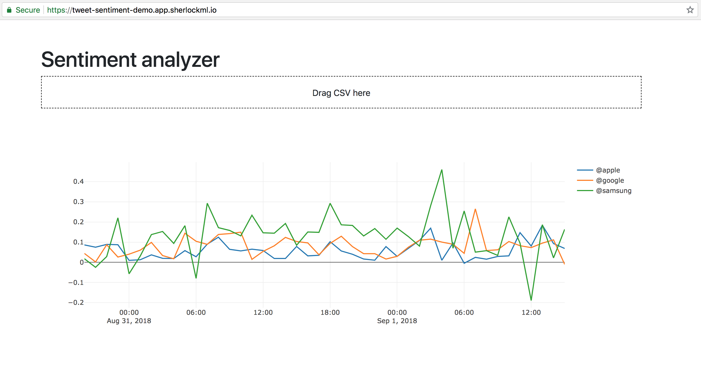

# Demo Plotly Dash application

Demo application demonstrating creating a very simple Plotly Dash application. This application was presented at ODSC Europe in September 2018.



## Running the application

In the `app/` directory, run:

```
python app.py
```

You can find sample CSVs to upload at:
- [larger dataset](http://fileshare.pascalbugnion.net/tweets-sentiment-analysis/all-tweets.csv): this contains about 18,000 tweets.
- [subsampled dataset](http://fileshare.pascalbugnion.net/tweets-sentiment-analysis/subsampled-tweets.csv): this contains about 15,00 tweets.


